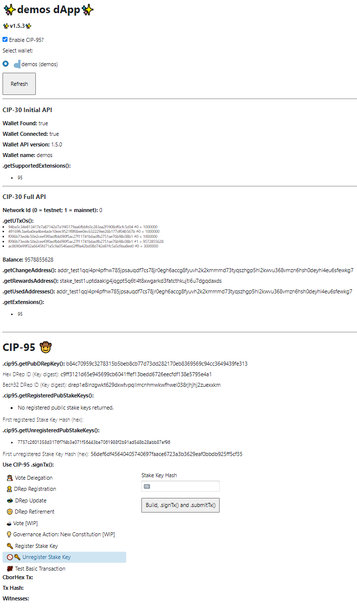
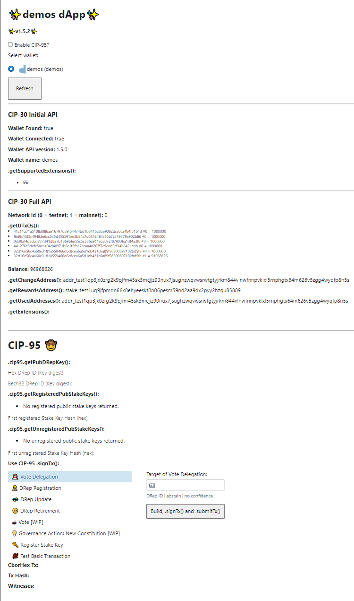
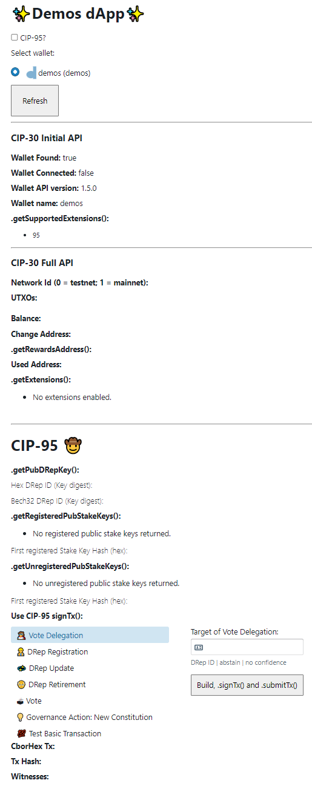
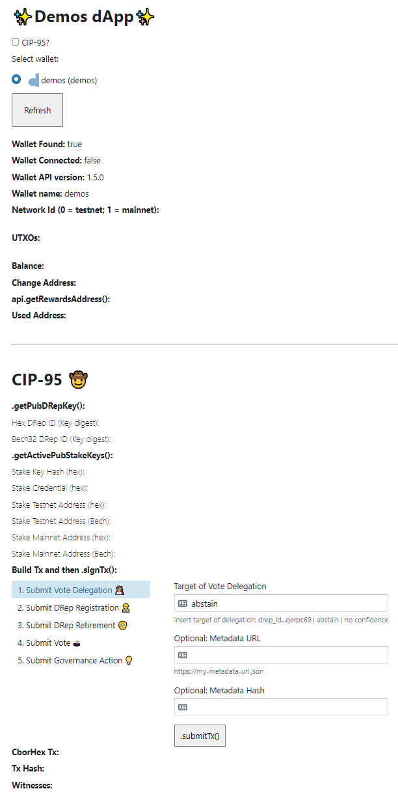

# Tags

### 1.5.3

- Added stake key unreg
- Fixed and tested vote submission
- Changed UTxO selection strategy to prioritize 1
- CSL Alpha v7

## 1.5.2

Compared to 1.5.1:
- Looks nicer
- Added some basic error handling
- Added a register stake key option
- Changed UTxO selection strategy

## 1.5.1

Compared to 1.5.0
- this fixes building conway Tx where fee would be calculated incorrectly
- makes things look slightly nicer

## 1.5.0
  
#### Conway:
- Uses CSL Alpha build 5 to build Conway artefacts.
- Supports building and signing transactions with:
  - Empty Tx 
  - DRep Registration
  - DRep Retirement
  - DRep Update
  - Vote Delegation
  - Votes
  - Governance Action 
- **Submission to Sancho untested**

#### CIP-95:
- `.cip95.getPubDRepKey()`
- `.cip95.getRegisteredPubStakeKeys()`
- `.cip95.getUnregisteredPubStakeKeys()`
- `.cip95.signData()` **NOT implemented**
- `signTx()`

#### Misc

Added .getSupportedExtensions() and .getExtensions()

## 1.4.0
  
#### Cardano Serialization Library Conway Alpha:
- Does not use any Conway alpha builds.

#### CIP-95:
- `.getPubDRepKey()`
  - Should work correctly as expected.
- `.getPubActiveStakeKeys()`
  - Calls from wallet and displays the first of the array.
- `.signTx()`
  - No conway items supported properly (waiting for Sancho + CML/CSL).
  - Supports generating and signing of metadata transactions which take user input.
- `.signData()`
  - No conway items supported properly (waiting for Sancho + CML/CSL).
  - Not implemented at all.

