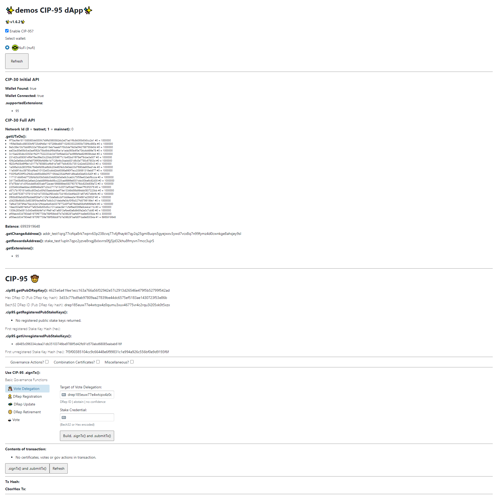
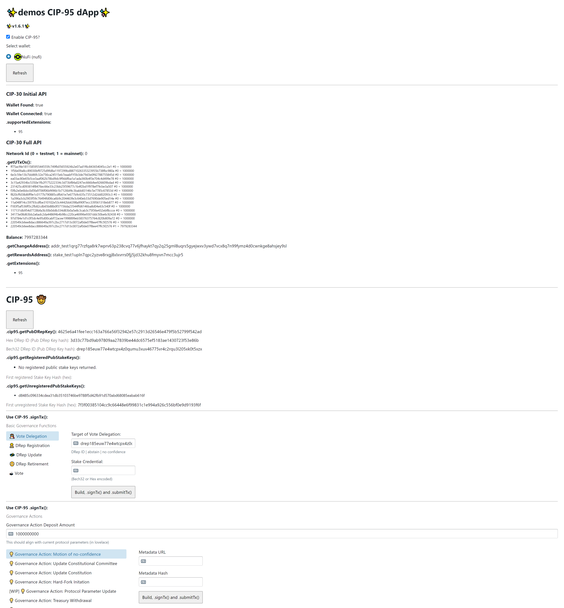
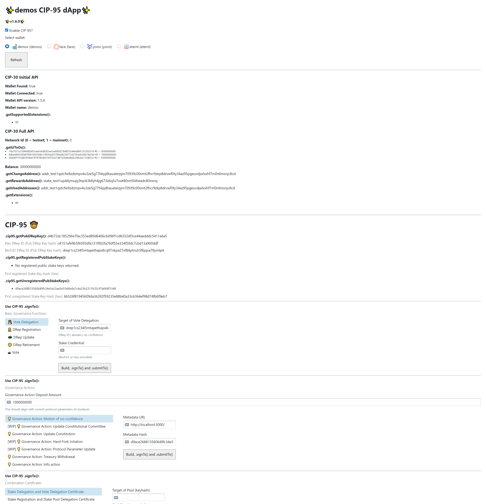
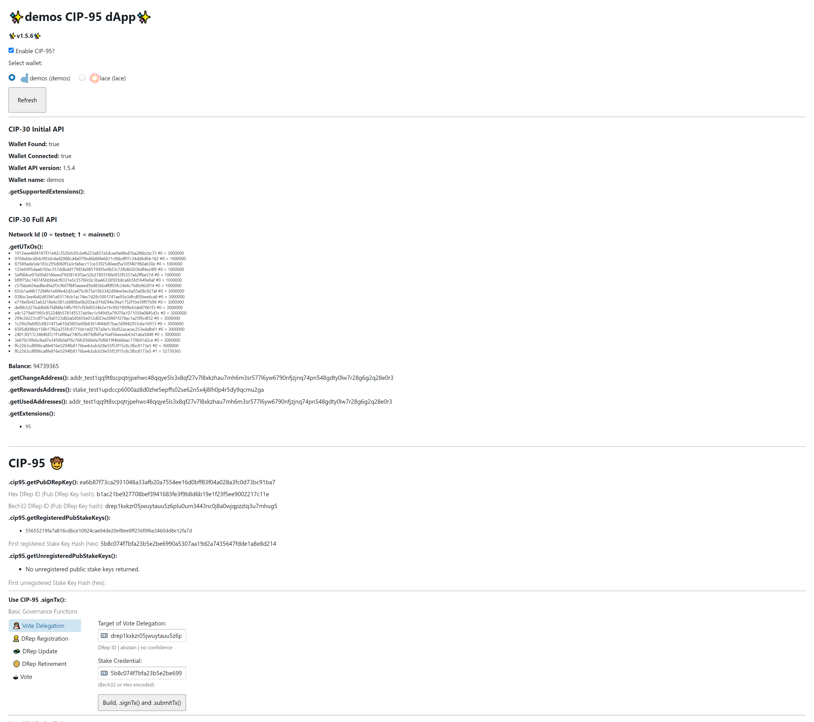
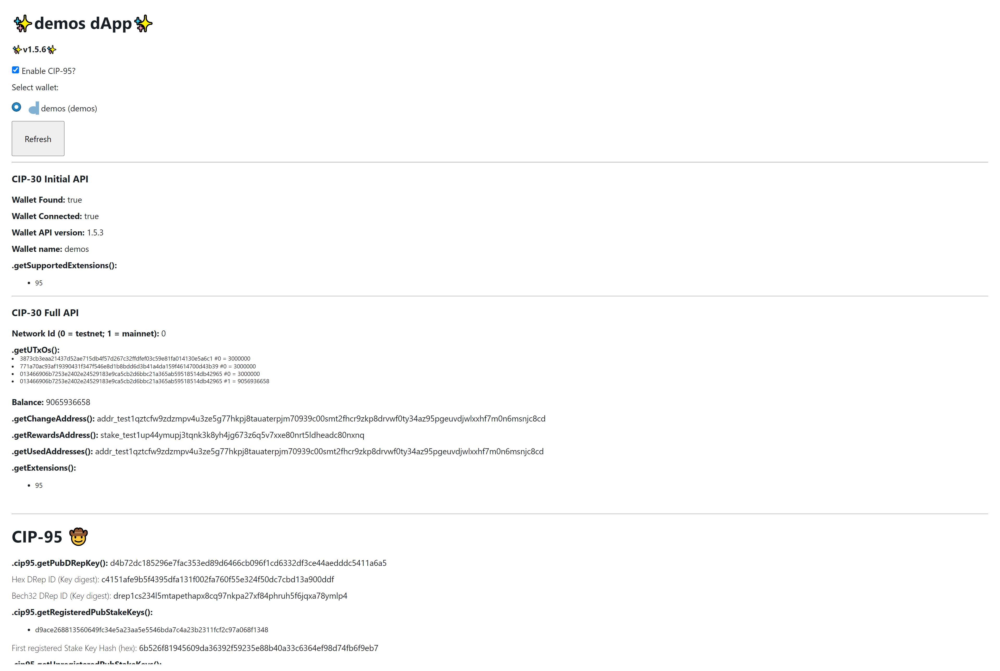
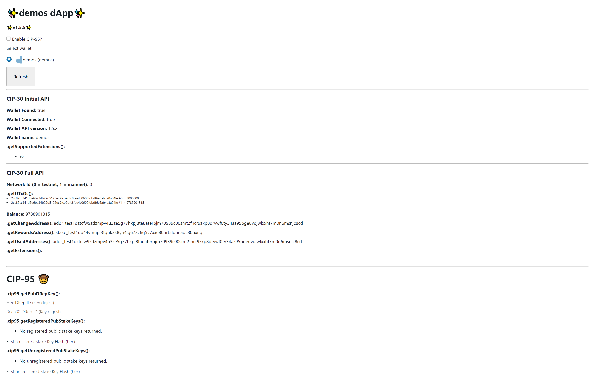

# Tags

### 1.6.3
- Fixed combination certs
- Added CC certs

### 1.6.2
- multiple certs in one transaction
- multiple votes in one transaction
- multiple goActs in one transaction
- make UI modular with tickboxes

### 1.6.1
- General UI improvements
- Improved update committee
- Improved handelling of refunds
- CSL alpha 13

### 1.6.0
- Add in combination certs
- Unhardcoded DRep and Gov Act deposits
- Refactor and split code

### 1.5.8
- Added new Conway Stake Reg and Unreg certs

### 1.5.7
- Bump to CSL alpha 11
- UI refresh
- Fix info action
- Add no confidence action
- Add placeholder for protocol parameter update
- Add placeholder for HF
- Refactoring
- default to CIP-95 enabled

### 1.5.6
- Added treasury withdrawal
- WIP Info action
- WIP Update committee
- Fixed UTxO selection strategy

### 1.5.5
- CSL Alpha v10
- Fixed delegating to predefined DReps

### 1.5.4 
- CSL Alpha v8
- Fixed New Const Gov Act

### 1.5.3

- Added stake key unreg
- Fixed and tested vote submission
- Changed UTxO selection strategy to prioritize 1
- CSL Alpha v7

## 1.5.2

Compared to 1.5.1:
- Looks nicer
- Added some basic error handling
- Added a register stake key option
- Changed UTxO selection strategy

## 1.5.1

Compared to 1.5.0
- this fixes building conway Tx where fee would be calculated incorrectly
- makes things look slightly nicer

## 1.5.0
  
#### Conway:
- Uses CSL Alpha build 5 to build Conway artefacts.
- Supports building and signing transactions with:
  - Empty Tx 
  - DRep Registration
  - DRep Retirement
  - DRep Update
  - Vote Delegation
  - Votes
  - Governance Action 
- **Submission to Sancho untested**

#### CIP-95:
- `.cip95.getPubDRepKey()`
- `.cip95.getRegisteredPubStakeKeys()`
- `.cip95.getUnregisteredPubStakeKeys()`
- `.cip95.signData()` **NOT implemented**
- `signTx()`

#### Misc

Added .getSupportedExtensions() and .getExtensions()

## 1.4.0
  
#### Cardano Serialization Library Conway Alpha:
- Does not use any Conway alpha builds.

#### CIP-95:
- `.getPubDRepKey()`
  - Should work correctly as expected.
- `.getPubActiveStakeKeys()`
  - Calls from wallet and displays the first of the array.
- `.signTx()`
  - No conway items supported properly (waiting for Sancho + CML/CSL).
  - Supports generating and signing of metadata transactions which take user input.
- `.signData()`
  - No conway items supported properly (waiting for Sancho + CML/CSL).
  - Not implemented at all.

